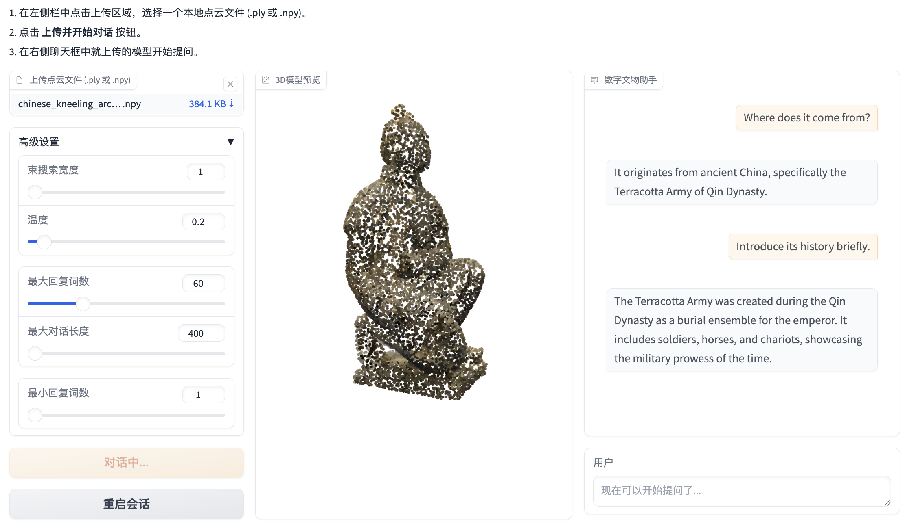

# 智云文博
### —— 基于3D点云大模型的数字文物交互系统
### A Digital Cultural Relic Interaction System Based on 3D Point Cloud Large Language Model


---

## 📖 项目简介 (Introduction)

本项目针对当前数字博物馆普遍存在“展品三维化，交互平面化”的痛点，即用户虽能观察3D文物模型，却无法进行深度信息交互的问题，提出了一套名为“智云文博”的交互式导览解决方案。

我们以先进的 **MiniGPT-3D** 框架为技术基座，通过构建一个专属于**中华文物领域**的高质量“3D点云-文本”数据集，并对模型进行针对性的二次微调，成功实现了一个能够深度“理解”文物、并与用户进行自然语言对话的智能系统。

This project, "Zhi-Yun-Wen-Bo," addresses a key pain point in current digital museums: while 3D models of artifacts are common, the interaction remains superficial. Users can view the models but cannot engage in deep, informational conversations about them.

Built upon the state-of-the-art **MiniGPT-3D** framework, we developed a solution by constructing a high-quality, domain-specific datasetdestruction for Chinese cultural artifacts and fine-tuning the model accordingly. The result is an intelligent system that can truly "understand" 3D artifacts and converse with users in natural language.

## 💬 效果演示 (Demo)




## 🚀 环境部署 (Deployment)

请按照以下步骤在本地部署本项目。

### 1. 克隆代码库 (Clone the Repository)

```bash
git clone https://github.com/Yt-pY/Tiaozhanbei.git
cd Tiaozhanbei
```

### 2. 创建并激活运行环境 (Create and Activate Running Environment)

我们建议使用 Conda 来管理项目环境，以保证依赖的统一性。

```bash
conda env create -f environment.yml
conda activate tiaozhanbei
pip install gradio
bash env_install.sh
```

### 3. 下载模型权重 (Download Model Weights)

本项目需要加载经过微调的模型权重才能正常运行，此外还包括大语言模型等一系列权重。


1. 下载必要的 [模型权重](https://huggingface.co/YuanTang96/MiniGPT-3D/tree/main).
2. 将 `params_weight` 文件夹放入 `Tiaozhanbei` 文件夹下
3. 在 Google drive 上下载经过数字文物微调后的 [模型权重 checkpoint_2.pth](https://drive.google.com/file/d/1x9YQsuHkFltUzim5UIWH_4x6hvJYRQ9P/view?usp=sharing)，放置在 `Tiaozhanbei/output/test/stage_3_big-cnew` 路径下


最终项目结构如下
```
Tiaozhanbei/
├── output/test/stage_3_big-cnew
│   └── checkpoint_2.pth
├── params_weight
│   └── ...
└── ...
```

## ▶️ 启动项目 (Run the Project)

完成以上所有步骤后，运行以下命令即可启动 Gradio 交互界面。

```bash
gradio UI_demo_v2.py
```

启动成功后，终端会显示一个本地URL (通常是 `http://127.0.0.1:7860`)。请在浏览器中打开此链接，即可开始使用“智云文博”系统。

## 🙏 致谢 (Acknowledgements)

本项目的实现离不开优秀的开源社区。我们的工作是基于 **MiniGPT-3D** 项目进行的。在此，我们向原作者的杰出工作表示诚挚的感谢。

Our work is built upon the excellent open-source project **MiniGPT-3D**. We would like to express our sincere gratitude to the original authors for their outstanding contributions.

*   **MiniGPT-3D 论文:** [arXiv:2405.01413](https://arxiv.org/abs/2405.01413)
*   **MiniGPT-3D GitHub:** [https://github.com/TangYuan96/MiniGPT-3D](https://github.com/TangYuan96/MiniGPT-3D)
